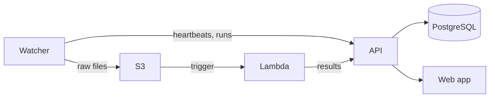

# Data Hub

Data Hub is a platform for automatically ingesting, processing, and visualizing data from laboratory instruments. Lab instrument PCs run a **watcher** agent that uploads raw files to S3, an AWS **Lambda** function processes them through instrument-specific pipelines, and a **Next.js** web application provides a dashboard and REST API backed by PostgreSQL.



## Repository structure

| Directory | Description |
| --- | --- |
| `web/` | Next.js web application and REST API (Vercel) |
| `lambda/` | AWS Lambda function for instrument data processing |
| `watcher/` | CLI agent for lab instrument PCs |
| `packages/shared/` | Shared Python library (S3, enums, test infra) |
| `developer-docs/` | Project documentation |

## Getting started

```sh
# Install Python packages (all workspace members).
uv sync --all-packages

# Install web app dependencies.
cd web && npm install && cd ..

# Set up environment variables for the web app.
cd web && vercel env pull && cd ..

# Create and initialize the local database.
cd web && createdb data-hub-local && npm run db:push && cd ..

# Start the dev server.
make dev
```

See the full [Getting started guide](developer-docs/getting-started.md) for prerequisites and details. Don't have AWS/Google credentials? [Local development](developer-docs/local-development.md) covers a zero-credential setup for the web app + API + database alone (no watcher or Lambda needed).

Developer docs live in [developer-docs/](developer-docs/README.md). You can find user documentation (self-hosted deployment, watcher installation, adding an instrument, managing tokens) on the [docs site](https://datahub.arcadiascience.com/docs).

## Checks and tests

```sh
# Format, lint, and type-check everything.
make check-all

# Run all Python tests.
make py-test

# Run Python unit tests only.
make py-test-unit

# Run Python integration tests (requires Postgres).
make py-test-integration

# Run web app unit tests.
make fe-test-unit

# Run API integration tests (requires Postgres).
make fe-test-integration
```

## License

Data Hub is released under the [MIT License](LICENSE). Copyright (c) 2026 Arcadia Science.

"Data Hub" and "Arcadia Science", along with related names and logos, are marks of Arcadia Science. The MIT License covers the source code only and does not grant any right to use these names or logos.
