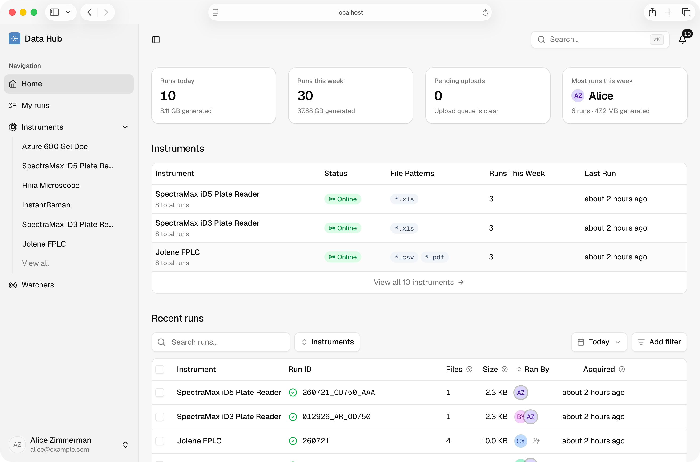
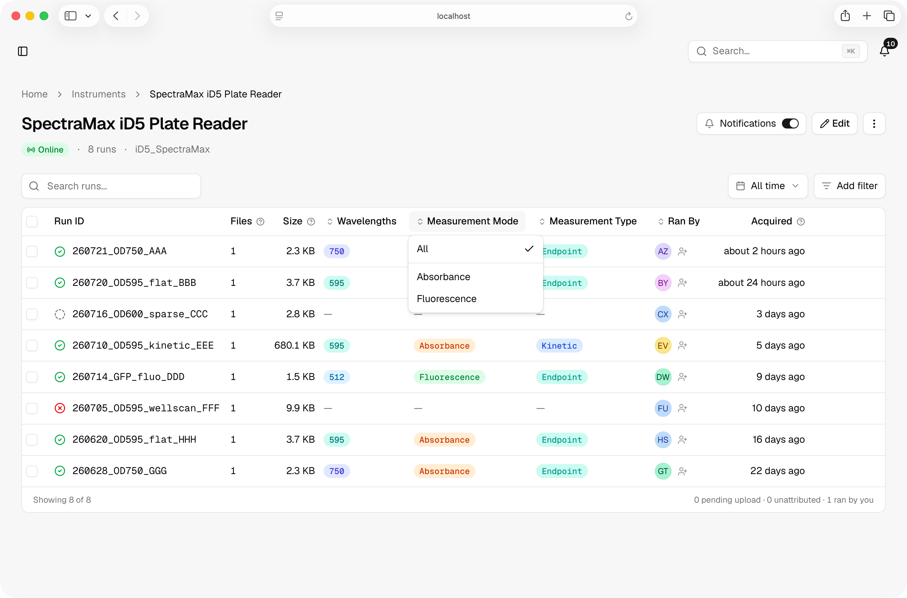
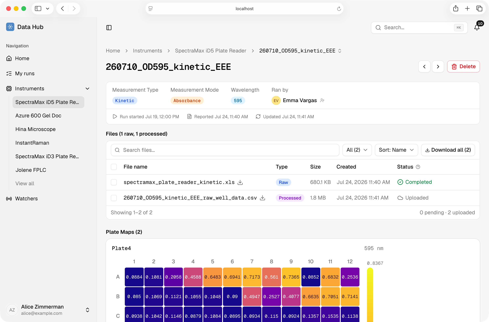
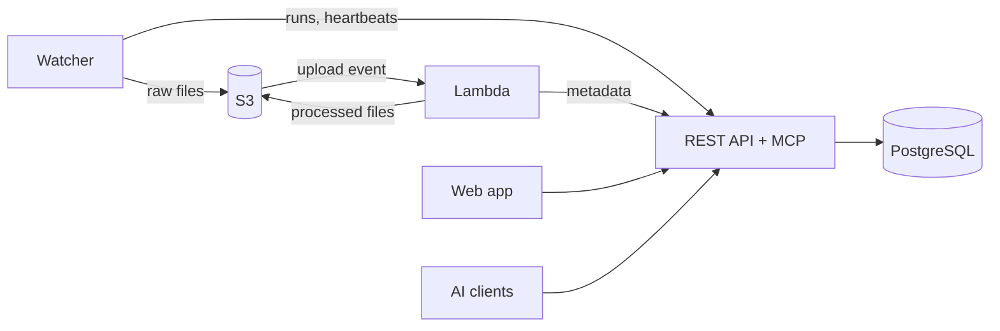

# Data Hub

Data Hub is a platform for automatically capturing, processing, and visualizing data from laboratory instruments. Lab instrument PCs run a watcher service that uploads files to S3, an AWS Lambda function processes them through instrument-specific pipelines, and a Next.js web application provides a dashboard, REST API, and MCP server for scientists to use.

Nobody signs up for Data Hub. Your team deploys it, so raw instrument data and everything derived from it stay on infrastructure you control. The source is MIT licensed.

[Documentation](https://datahub.arcadiascience.com/docs) · [Set up an instrument](https://datahub.arcadiascience.com/docs/set-up-an-instrument) · [Deploy it yourself](developer-docs/first-time-deployment.md) · [Architecture](developer-docs/architecture.md)







## Web app, REST API, and MCP

A run shows up in three places at once:

- **Web app**: find a run by instrument, date, or who ran it, read plate maps and images in the page, claim your work, and download files. See the [web app guide](https://datahub.arcadiascience.com/docs/browse-runs).
- **REST API**: served at `/api/v1/`, with an OpenAPI 3.1 document at `/api/v1/openapi.json` so you can generate a client instead of writing one. See the [API reference](https://datahub.arcadiascience.com/docs/api).
- **MCP server**: served at `/api/v1/mcp`, so Claude Code, Claude Desktop, or Cursor can search runs and fetch files during a conversation. See the [MCP setup](https://datahub.arcadiascience.com/docs/mcp).

All three authenticate with tokens you create in the app, scoped and revocable. A read-only token stays read-only whichever route it takes.

## Supported instruments

Seven instrument types have a processor that reads the vendor's format after upload and writes metadata and viewable artifacts alongside the untouched original:

| Instrument | What processing adds |
| --- | --- |
| SpectraMax iD3 and iD5 plate readers | Well-data CSV and interactive plate maps |
| Azure 600 gel doc | Contrast-enhanced PNG preview and imaging settings |
| Azure Cielo qPCR | Dye channels read from the Cq values export |
| Agilent 4150 TapeStation | Tape type and the run report |
| Cytiva ÄKTA FPLC | Chromatography run report |
| Epson V700 scanner | Plate preview and colony measurements |
| Hina microscope (Nikon ND2) | Channel overlay JPG and channel list |

An instrument with no matching processor still uploads, and its files stay searchable and downloadable. What it misses is extracted metadata and rendered previews. Adding a type is a code change in `web/` and `lambda/` rather than a settings change, described in [Lambda](developer-docs/lambda.md).

## How it works



Four components coordinate through S3 and the API. The watcher and the Lambda never talk to each other, because S3 is the durable hand-off between them. File bytes travel directly between S3 and the client over presigned URLs rather than through the web app.

| Directory | Package | Role |
| --- | --- | --- |
| `web/` | `data-hub-web` | Next.js dashboard, REST API, and MCP server, backed by PostgreSQL. Runs on Vercel. |
| `lambda/` | `data-hub-lambda` | AWS Lambda triggered by S3 uploads. Runs the per-instrument processors and builds run archives. |
| `watcher/` | `data-hub-watcher` | Command-line program that runs on instrument PCs, published to PyPI. Detects runs, uploads files, reports health. |
| `packages/shared/` | `data-hub-shared` | S3 utilities, instrument enums, and test infrastructure shared by the two Python packages. |
| `infra/` | | AWS SAM templates for the S3 buckets, the Lambda, and the IAM roles. |
| `developer-docs/` | | Contributor and self-hosting documentation. |

[Architecture](developer-docs/architecture.md) covers the full data flow, both upload modes, and the reasoning behind each design decision.

## Documentation

Docs are split by who is reading:

- **Using Data Hub**: [datahub.arcadiascience.com/docs](https://datahub.arcadiascience.com/docs) covers installing the watcher, setting up an instrument, browsing runs, issuing tokens, permissions, and reference pages for the watcher command line, the API, and MCP. It is built from the [data-hub-docs](https://github.com/Arcadia-Science/data-hub-docs) repository.
- **Building or hosting Data Hub**: [developer-docs/](developer-docs/README.md) covers local setup, architecture, testing, conventions, CI, and the deployment runbooks.

## Run it locally

The web app, API, and database run with no AWS or Google credentials, which is enough for work on the UI, REST endpoints, MCP tools, or the schema. You need PostgreSQL 15 or later and Node.js 22 or later:

```sh
cd web && npm install && cd ..
createdb data-hub-local
# Create web/.env. The keys it needs are listed in developer-docs/local-development.md.
make db-reseed
make dev
```

Open `http://localhost:3000/login` and use the **Sign in (dev)** button with `alice@example.com`. `make db-reseed` seeds instruments, runs, and files, and prints a personal access token for API calls.

Changing the watcher or the Lambda needs Python 3.13 and [uv](https://docs.astral.sh/uv/) as well, then `uv sync --all-packages`. [Getting started](developer-docs/getting-started.md) lists the full prerequisites; [Local development](developer-docs/local-development.md) explains the zero-credential path, including how to render real file bytes from a local S3 mirror.

## Deploy your own

A deployment is a PostgreSQL database, the web app on Vercel, three S3 buckets, and one Lambda. A Google OAuth client created during the deploy decides who can sign in at all. [First-time deployment](developer-docs/first-time-deployment.md) walks through it in order, and [CI and deployment](developer-docs/ci-and-deployment.md) covers the `staging` and `production` branches and what redeploys on merge.

## Checks and tests

Run both before opening a pull request:

```sh
make check-all  # Format, lint, and type-check Python and TypeScript.
make test       # Python and web tests, unit and integration.
```

Integration tests need PostgreSQL, and the web suite builds the app into `web/.next`, so stop `make dev` before running them. [Testing](developer-docs/testing.md) describes each suite and the shared test server; [Conventions](developer-docs/conventions.md) covers S3 key layout, instrument IDs, and code style.

## License

Data Hub is released under the [MIT License](LICENSE). Copyright (c) 2026 Arcadia Science.

“Data Hub” and “Arcadia Science”, along with related names and logos, are marks of Arcadia Science. The MIT License covers the source code only and does not grant any right to use these names or logos.
