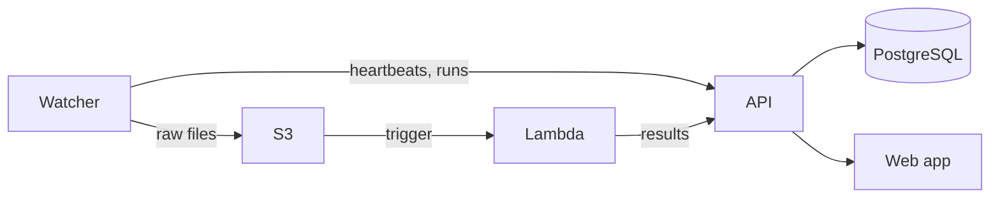

# Data Hub

Data Hub is a platform for automatically ingesting, processing, and visualizing data from laboratory instruments. Lab instrument PCs run a **watcher** agent that uploads raw files to S3, an AWS **Lambda** function processes them through instrument-specific pipelines, and a **Next.js** web application provides a dashboard and REST API backed by PostgreSQL.



## Repository structure

| Directory | Description | Docs |
| --- | --- | --- |
| `web/` | Next.js web application and REST API (Vercel) | [API reference](developer-docs/reference/api.md) |
| `lambda/` | AWS Lambda function for instrument data processing | [Lambda docs](developer-docs/reference/lambda.md) |
| `watcher/` | CLI agent for lab instrument PCs | [Watcher docs](developer-docs/reference/watcher.md) |
| `packages/shared/` | Shared Python library (S3, enums, test infra) | [Shared library](developer-docs/reference/shared-library.md) |
| `docs/` | Project documentation | — |

## Quick start

```sh
# Install Python packages (all workspace members).
uv sync --all-packages

# Install web app dependencies.
cd web && npm install && cd ..

# Set up environment variables for the web app.
cd web && vercel env pull && cd ..

# Create and initialize the local database.
cd web && createdb data-hub-local && npm run db:push && cd ..

# Start the dev server.
make dev
```

See the full [Getting Started guide](developer-docs/getting-started.md) for prerequisites and details.

## Documentation

### Guides

- [Local development](developer-docs/local-development.md) — zero-credential dev workflow for the web app + API + database (no watcher / Lambda needed)
- [Adding an instrument](developer-docs/guides/adding-an-instrument.md) — end-to-end: watcher setup, activation, optional Lambda preprocessing
- [Installing a watcher](developer-docs/guides/installing-a-watcher.md) — lab operator focused: init, watch, troubleshooting
- [Managing tokens](developer-docs/guides/managing-tokens.md) — creating, using, and revoking API tokens

### Reference

- [Architecture](developer-docs/architecture.md) — system overview, data flow, and design decisions
- [Getting started](developer-docs/getting-started.md) — development setup, environment variables, running locally
- [Watcher](developer-docs/reference/watcher.md) — CLI commands, configuration, run detection, upload modes
- [Lambda](developer-docs/reference/lambda.md) — processing pipeline, supported instruments, adding new instruments
- [REST API](developer-docs/reference/api.md) — endpoint reference and authentication
- [MCP server](developer-docs/reference/mcp.md) — tools, resources, prompts, and installation for Claude Desktop / Cursor
- [Shared library](developer-docs/reference/shared-library.md) — module reference for `data-hub-shared`
- [CI and deployment](developer-docs/ops/ci-and-deployment.md) — GitHub Actions, Vercel, Render, Lambda deployment
- [Conventions](developer-docs/conventions.md) — S3 key layout, instrument IDs, code style, environments

## Development

```sh
# Run formatting, linting, and type checking.
make check-all

# Run all Python tests.
make py-test

# Run Python unit tests only.
make py-test-unit

# Run Python integration tests (requires Postgres).
make py-test-integration

# Run API integration tests (requires Postgres).
make fe-test-integration
```
