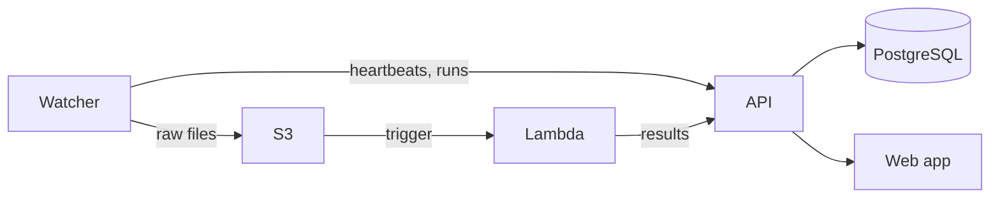

# Data Hub

Data Hub is a platform for automatically ingesting, processing, and visualizing data from laboratory instruments. Lab instrument PCs run a **watcher** agent that uploads raw files to S3, an AWS **Lambda** function processes them through instrument-specific pipelines, and a **Next.js** web application provides a dashboard and REST API backed by PostgreSQL.



## Repository structure

| Directory | Description | Docs |
| --- | --- | --- |
| `web/` | Next.js web application and REST API (Vercel) | [API reference](https://arcadia-data-hub-docs.vercel.app/docs/api-reference) |
| `lambda/` | AWS Lambda function for instrument data processing | [Lambda docs](developer-docs/lambda.md) |
| `watcher/` | CLI agent for lab instrument PCs | [Watcher docs](developer-docs/watcher.md) |
| `packages/shared/` | Shared Python library (S3, enums, test infra) | [Shared library](developer-docs/shared-library.md) |
| `developer-docs/` | Project documentation | [Index](developer-docs/README.md) |

## Quick start

```sh
# Install Python packages (all workspace members).
uv sync --all-packages

# Install web app dependencies.
cd web && npm install && cd ..

# Set up environment variables for the web app.
cd web && vercel env pull && cd ..

# Create and initialize the local database.
cd web && createdb data-hub-local && npm run db:push && cd ..

# Start the dev server.
make dev
```

See the full [Getting Started guide](developer-docs/getting-started.md) for prerequisites and details.

## Documentation

User, operator, and admin documentation (installing a watcher, adding an instrument, managing tokens, deployment) lives on the [docs site](https://arcadia-data-hub-docs.vercel.app/), not in this repository.

Documentation for developing Data Hub itself lives in [developer-docs/](developer-docs/README.md), starting with [Getting started](developer-docs/getting-started.md).

## Development

```sh
# Run formatting, linting, and type checking.
make check-all

# Run all Python tests.
make py-test

# Run Python unit tests only.
make py-test-unit

# Run Python integration tests (requires Postgres).
make py-test-integration

# Run web app unit + in-memory MCP tests.
make fe-test-unit

# Run API integration tests (requires Postgres).
make fe-test-integration
```

## License

Data Hub is released under the [MIT License](LICENSE). Copyright (c) 2026 Arcadia Science.

"Data Hub" and "Arcadia Science", along with related names and logos, are marks of Arcadia Science. The MIT License covers the source code only and does not grant any right to use these names or logos.
