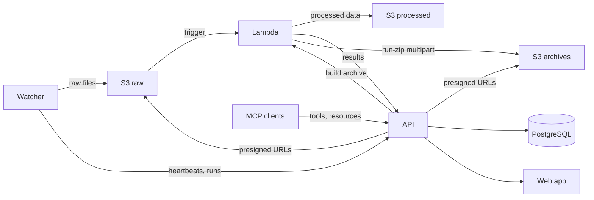

# Architecture

Data Hub is a platform for automatically ingesting, processing, and visualizing data from laboratory instruments. It is structured as a monorepo with four components that work together through S3, a REST API, and a shared Python library.

## System overview

## Components

| Directory | Package | Description |
| --- | --- | --- |
| `web/` | `data-hub-web` | Next.js web application, REST API, and MCP server. Deployed on Vercel. |
| `lambda/` | `data-hub-lambda` | AWS Lambda function triggered by S3 uploads. Runs instrument-specific processing pipelines. |
| `watcher/` | `data-hub-watcher` | CLI installed on lab instrument PCs. Detects new files, uploads them to S3, and reports status to the API. |
| `packages/shared/` | `data-hub-shared` | Shared Python library providing S3 utilities, instrument enums, and test infrastructure. |

## Data flow

### Automatic upload (auto mode)

1. A lab instrument writes output files to a watched directory.
2. The **watcher** detects new stable files using filesystem events (`watchdog`).
3. It groups files into runs (by filename prefix or subdirectory) and reports each run to the **API**.
4. It uploads raw files to **S3** at the key `{instrument_id}/{run_id}/{filename}`.
5. The S3 upload triggers the **Lambda** function.
6. Lambda downloads the file and dispatches to the appropriate instrument processor for preprocessing (e.g., extracting metadata).
7. Lambda creates/updates the run and files via the **API**. The API sends a **Slack** notification once per newly-created run.
8. Users view the run in the **web dashboard**.

### Manual upload (manual mode)

Steps 1–3 are the same, but the watcher does not upload immediately. Instead:

4. The server adds files to an upload queue.
5. On each heartbeat tick, the watcher polls the upload queue and uploads requested files.
6. Steps 5–8 from automatic mode follow.

## Key design decisions

- **S3 as the integration boundary.** The watcher and Lambda never communicate directly. S3 acts as a durable hand-off point: the watcher writes, Lambda reads.
- **API-driven coordination.** The watcher registers with the API, syncs its YAML config, and sends periodic heartbeats. This lets the web dashboard show watcher health and manage upload queues.
- **Presigned URLs from the API.** The web app generates presigned S3 upload and download URLs so watchers and browsers can transfer files directly to/from S3 without routing data through the API. On Vercel, the app assumes an IAM role via OIDC federation (no long-lived AWS credentials).
- **Lambda-built run archives.** The "Download all" actions on a run delegate to the Lambda, which streams files from the raw + processed buckets directly into a zip in a separate `arcadia-data-hub-archives-{env}` bucket via S3 multipart upload. The web app then 302s the browser to a short-lived presigned URL on that archive — bytes never traverse Vercel, eliminating Fast Origin Transfer for run downloads. Builds are cached at `runs/{instrument_id}/{run_id}/{fingerprint}.zip` and expire after 7 days. Every cache miss is dispatched asynchronously: the route inserts an `archive_jobs` row, schedules the Lambda invocation via `after()`, returns `202 { job_id }`, and the UI polls the same `/download-archive` URL (which HEADs S3 on each call) until the artifact appears — making the S3 object, not the row's `status`, the source of truth for "ready". See [Run archives](run-archives.md) for the full flow and runbook.
- **Google OAuth with database sessions.** Better Auth signs people in with Google Workspace and stores sessions in the `session` table, with a short-lived signed cookie cache so most page renders avoid a DB round-trip. The Drizzle adapter also writes `user` and `account` rows, so members and their linked Google identities stay queryable. Google is the only gate on who gets in, since Data Hub has no email allowlist or domain check of its own; `ADMIN_EMAILS` is a one-way promotion applied on sign-in, not an entry check. The `is_admin` flag is exposed on the session for cheap UI gating, but every privileged mutation re-reads it from the database, so a demotion takes effect on the next request instead of the next sign-in. Vercel preview deployments can proxy Google SSO through staging via Better Auth's `oAuthProxy` plugin (`OAUTH_PROXY_URL` / `OAUTH_PROXY_SECRET`) so each ephemeral preview URL need not be registered in Google Cloud Console. Non-production builds also enable email/password for the "Sign in (dev)" form, described in [Local development](local-development.md#sign-in-dev-only).
- **Public page metadata, gated bodies.** Routes commonly shared into Slack/Notion (dashboard, instruments, instrument and run detail, settings) are reachable without a session so link unfurlers can read `<head>` metadata; the page or layout renders a `SignInRequired` CTA in place of the real body when there's no session. `/watchers/*` stays redirected to `/login` by `web/proxy.ts`. Three independent layers prevent search indexing: a `robots` field on the root layout, an `app/robots.ts` that disallows all generic crawlers (with an allow-list for unfurl bots), and an `X-Robots-Tag: noindex, nofollow` header on every response.
- **Shared library for contracts.** Instrument IDs, S3 utilities, and environment config live in `data-hub-shared` so they stay consistent across Lambda and the watcher without duplicating code.
- **Wildcard PAT scope for the legacy backfill.** Migration `0022_pat_scopes` backfilled every pre-existing token with `["*"]` so deployed watchers and the Lambda kept working once scope enforcement shipped. `POST /api/v1/tokens` rejects `*` from API callers, so every token minted since carries explicit least-privilege scopes; see [Security and permissions](https://datahub.arcadiascience.com/docs/security#token-scopes) for the scope vocabulary.
- **MCP for AI access (OAuth).** Streamable-HTTP MCP at `/mcp/v1` exposes tools, resources, and prompts. Clients use Better Auth as the OAuth AS (issuer `{BETTER_AUTH_URL}/api/auth`); discovery via `/.well-known/oauth-protected-resource` (incl. `/mcp/v1`), `/.well-known/oauth-authorization-server`, and `/.well-known/openid-configuration`, with consent at `/consent`. Coarse scopes: transport requires `read`; mutating tools need `write`. JWTs are verified offline via JWKS (~1h), so revoking consent does not kill them immediately — opaque tokens still honor DB/session checks. `MCP_ALLOW_PAT_AUTH=true` optionally accepts PATs outside production (hard-disabled when `VERCEL_ENV=production`). See [Local development](local-development.md#connecting-an-mcp-client) and the [MCP overview](https://datahub.arcadiascience.com/docs/mcp).
- **Integration tests against a real server.** The shared `testing.py` module spins up a real Next.js server backed by a Postgres database, so Lambda and watcher integration tests exercise the actual API surface.
