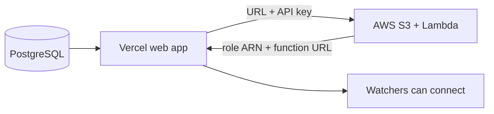

# First-time deployment

Data Hub is self-hosted: before anyone can install a watcher or sign in, your team stands up the backend infrastructure. This guide walks through deploying one environment (`staging` shown; repeat the same steps for `production`) from scratch, in order. For the CI workflows and how subsequent deploys happen automatically, see [CI and deployment](ci-and-deployment.md). For how the pieces fit together at runtime, see [Architecture](architecture.md).

## What you'll deploy

| Resource | What it is | Where it runs |
| --- | --- | --- |
| **PostgreSQL database** | System of record for instruments, runs, files, watchers, and tokens. | Any PostgreSQL host (e.g. Render, Supabase, Neon). |
| **Web app + REST API** | The Next.js app that serves the dashboard, REST API, and MCP server. | Vercel. |
| **AWS infrastructure** | S3 buckets for raw/processed/archive data and the Lambda that preprocesses uploads. | AWS (via SAM). |

Give each environment (`staging`, `production`) its own database and its own AWS stack. They are independent deployments with independent data.

## Order of operations

The web app and the AWS stack depend on each other's outputs, so the web app goes up first (to mint a URL and an API key), then AWS, then the AWS outputs are fed back into the web app.



1. [Provision a PostgreSQL database](#1-provision-a-postgresql-database).
2. [Deploy the web app to Vercel](#2-deploy-the-web-app-to-vercel).
3. [Bootstrap AWS](#3-bootstrap-aws-once-per-account) (once per account).
4. [Deploy the AWS infrastructure](#4-deploy-the-aws-infrastructure) for the environment.
5. [Finish wiring the web app](#5-finish-wiring-the-web-app) with the AWS stack outputs.

The web app deploys successfully before the AWS stack exists; its AWS-dependent features (uploads, reprocessing, run archives) don't work until step 5 wires the outputs back in.

## Prerequisites

Beyond the [general prerequisites](getting-started.md#prerequisites), you need:

- [AWS CLI](https://docs.aws.amazon.com/cli/latest/userguide/getting-started-install.html) — bootstrap commands and ECR login.
- [AWS SAM CLI](https://docs.aws.amazon.com/serverless-application-model/latest/developerguide/install-sam-cli.html) — used by `make sam-deploy` (`brew install aws-sam-cli` on macOS).
- **Admin-level AWS credentials** (`aws configure` or environment variables) for the initial deploy. The CI deploy role can update an existing stack but cannot create one from scratch.
- Access to the Vercel project and permission to set its environment variables.
- Permission to create a Google OAuth client for sign-in, in a Google Cloud project you control. You create it in [step 2](#create-a-google-oauth-client).

## 1. Provision a PostgreSQL database

Create a PostgreSQL database for the environment on any host you like — [Render](https://render.com), [Supabase](https://supabase.com), [Neon](https://neon.tech), or self-managed. Keep its connection string handy for the next step, and make sure the host accepts connections from Vercel and from GitHub-hosted runners (the [`apply-migrations.yml`](ci-and-deployment.md#apply-database-migrations-apply-migrationsyml) workflow connects from CI).

## 2. Deploy the web app to Vercel

The Next.js app (which also serves the REST API and MCP server) deploys on [Vercel](https://vercel.com). Every branch and commit generates a preview deployment; merges to `staging` and `production` deploy to those environments automatically.

### Create a Google OAuth client

Browser sign-in runs on Google OAuth, so the web app needs a client ID and secret before anyone can reach the dashboard. Create the client in [Google Cloud Console](https://console.cloud.google.com/apis/credentials). One client serves every environment as long as you register a redirect URI for each:

1. Configure the OAuth consent screen. **Internal** accepts only accounts in your Google Workspace organization; **External** accepts any Google account, including personal ones.
2. Create an **OAuth client ID** credential with application type **Web application**.
3. Add one authorized redirect URI per environment. The path is always `/api/auth/callback/google` on your deployment's host, so a staging URI reads `https://your-staging-deployment.vercel.app/api/auth/callback/google`.
4. Copy the client ID and secret. They become `AUTH_GOOGLE_ID` and `AUTH_GOOGLE_SECRET` in the next section.

That consent screen choice is the only gate on who can sign in. Data Hub has no email allowlist and no domain check of its own, so every account Google lets through gets a member record on first sign-in. `ADMIN_EMAILS` grants the admin role separately and is not an entry check. Choose **Internal** unless you mean to accept personal Google accounts. [Who can sign in](https://datahub.arcadiascience.com/docs/security#who-can-sign-in) states the same model for operators and admins.

> **Note:** Google matches redirect URIs exactly, and Vercel gives each preview deployment its own URL. To sign in on previews, enable Better Auth's OAuth proxy (below) so Google callbacks to the staging host and the profile is handed back to the preview. For laptop work, use the dev-only sign-in, which needs no Google client at all: see [Local development](local-development.md#sign-in-dev-only).

### Set the initial environment variables

In the Vercel dashboard, scoped to the environment, set at least the following. The AWS-related variables come later in [step 5](#5-finish-wiring-the-web-app); the full list lives in [Environment variables](getting-started.md#environment-variables).

| Vercel env var | Purpose |
| --- | --- |
| `DATABASE_URL` | Connection string from [step 1](#1-provision-a-postgresql-database). |
| `AUTH_SECRET` | Session encryption key (generate a 32+ character random string). |
| `BETTER_AUTH_URL` | Public origin of this deployment and OAuth issuer base (issuer `{origin}/api/auth`; e.g. `https://your-staging-deployment.vercel.app`). |
| `AUTH_GOOGLE_ID`, `AUTH_GOOGLE_SECRET` | Client ID and secret from the [OAuth client](#create-a-google-oauth-client) above. |
| `ADMIN_EMAILS` | Comma-separated emails auto-promoted to admin on sign-in. This bootstraps the first admin, so set it before you sign in. |
| `CRON_SECRET` | Shared secret for Vercel Cron jobs. The upload-queue sweep (`web/vercel.json`) rejects invocations without it. |
| `OAUTH_PROXY_URL` | Staging origin that owns the Google redirect URI (e.g. `https://your-staging-deployment.vercel.app`). Set on **Staging** and **Preview** to the same value. |
| `OAUTH_PROXY_SECRET` | Dedicated shared secret for the preview↔staging OAuth handoff (not `AUTH_SECRET`). Same value on Staging and Preview. |

Production does not need `OAUTH_PROXY_*` — register production's own `/api/auth/callback/google` URI and leave the proxy unset there. When `OAUTH_PROXY_URL` equals this deployment's `BETTER_AUTH_URL` (staging signing itself in), the proxy is a no-op.

You can pull the current values locally with:

```sh
cd web
vercel env pull
```

### Apply database migrations

Point Drizzle at the environment's database and apply the schema. After the first deploy, merges that touch `web/drizzle/` apply migrations automatically via CI; this initial run is manual:

```sh
cd web

# Apply committed migrations against DATABASE_URL.
npm run db:migrate
```

### Create an API key for the Lambda

Sign in with an account listed in `ADMIN_EMAILS`, then create a personal access token under Settings. Use the **Lambda** scope preset (or an equivalent list that includes `instruments:read`, `runs:create`, `runs:update`, `files:create`, `files:update`, and `archive-jobs:write`). The Lambda looks up each instrument's type before dispatching, so a token without `instruments:read` will 403 on every S3 event.

The AWS stack and the Lambda use this token as `DATA_HUB_API_KEY` to call the Data Hub API, so create it now and keep it for [step 4](#4-deploy-the-aws-infrastructure). See [Issue and revoke tokens](https://datahub.arcadiascience.com/docs/manage-tokens) for the token UI.

If you previously minted a Lambda token from an older preset that omitted `instruments:read`, revoke it and create a new one with the updated Lambda preset, then update the `DATA_HUB_API_KEY` secret / SAM parameter for each environment.

## 3. Bootstrap AWS (once per account)

A separate bootstrap stack (`infra/bootstrap.yaml`) creates shared, per-account resources: the ECR repository, the GitHub OIDC identity provider, and the Vercel OIDC identity provider. Deploy it once per AWS account:

```sh
make sam-bootstrap
```

> **Note:** If your account already has an OIDC provider for `token.actions.githubusercontent.com` (from another project), the bootstrap stack fails with an `AWS::EarlyValidation::ResourceExistenceCheck` error. Remove the `GitHubOidcProvider` resource from `bootstrap.yaml` (or skip the bootstrap stack) and reuse the existing provider's ARN. Check with `aws iam list-open-id-connect-providers`.

## 4. Deploy the AWS infrastructure

The storage and processing layer — the S3 buckets and the data-processing Lambda — is defined in `infra/template.yaml` and deployed with [AWS SAM](https://docs.aws.amazon.com/serverless-application-model/latest/developerguide/). The stack creates the raw/processed S3 buckets, the Lambda function (container image, function URL), a catch-all S3 `ObjectCreated:*` notification on the raw bucket, and the IAM roles for Lambda execution, CI deploys (OIDC), and Vercel web app S3 access (OIDC).

**1. Get the bootstrap stack outputs.**

```sh
aws cloudformation describe-stacks \
  --stack-name data-hub-bootstrap \
  --region us-west-1 \
  --query "Stacks[0].Outputs"
```

Note `GitHubOidcProviderArn`, `VercelOidcProviderArn`, and `EcrRepositoryUri` for the steps below.

**2. Build and push the Docker image to ECR.**

```sh
make docker-build-lambda
make docker-push-lambda ENV=staging
```

This logs in to ECR, tags the image `staging-<short-sha>`, and pushes it. The ECR registry is derived from your AWS account ID automatically.

**3. Deploy the per-environment stack.**

Create `infra/.env.staging` from the template and fill it in:

```sh
cp infra/.env.example infra/.env.staging
```

```sh
ECR_IMAGE_URI=<image-uri-from-step-2>
DATA_HUB_API_URL=https://your-staging-deployment.vercel.app/api/v1
DATA_HUB_API_KEY=<api-key-from-step-2>
GITHUB_OIDC_PROVIDER_ARN=<github-oidc-arn-from-step-1>
VERCEL_OIDC_PROVIDER_ARN=<vercel-oidc-arn-from-step-1>
```

Then deploy. The Makefile loads `infra/.env.staging` automatically when `ENV=staging` is set:

```sh
make sam-deploy ENV=staging
```

These `infra/.env.*` files are gitignored (only `infra/.env.example` is tracked).

**4. Configure GitHub environment secrets.**

These let CI handle every subsequent deploy. Grab the deploy role ARN:

```sh
aws cloudformation describe-stacks \
  --stack-name data-hub-staging \
  --region us-west-1 \
  --query "Stacks[0].Outputs[?OutputKey=='DeployRoleArn'].OutputValue" \
  --output text
```

In the GitHub repo, go to **Settings → Environments**, create a `staging` environment, and add:

| Secret | Value |
| --- | --- |
| `AWS_DEPLOY_ROLE_ARN` | Deploy role ARN from the stack output. |
| `GH_OIDC_PROVIDER_ARN` | GitHub OIDC provider ARN from the bootstrap stack. |
| `VERCEL_OIDC_PROVIDER_ARN` | Vercel OIDC provider ARN from the bootstrap stack. |
| `SAM_S3_BUCKET` | SAM CLI managed S3 bucket (see `sam deploy` output). |
| `DATA_HUB_API_URL` | Base API URL for the environment. |
| `DATA_HUB_API_KEY` | API key for Lambda → Data Hub auth (also used by the archive-job callback). |

## 5. Finish wiring the web app

The AWS stack you just deployed exposes the outputs the web app needs to reach it. Read `WebAppRoleArn` and `DataHubFunctionUrl` from the stack, then set these in Vercel for the environment:

| Vercel env var | Source | Purpose |
| --- | --- | --- |
| `AWS_ROLE_ARN` | `WebAppRoleArn` stack output | Lets the web app generate presigned S3 URLs and SigV4-sign Lambda Function URL invocations via OIDC federation. |
| `LAMBDA_FUNCTION_URL` | `DataHubFunctionUrl` stack output | The Lambda Function URL for manual reprocessing and archive builds. |

The S3 bucket names default to `arcadia-data-hub-raw-<env>` and `arcadia-data-hub-archives-<env>`; override `S3_RAW_DATA_BUCKET` and `S3_ARCHIVES_BUCKET` in Vercel only if your stack uses different names. Redeploy the web app (or push a commit) so it picks up the new variables.

> **Note:** Slack channel notifications are configured after deploy, not via an environment variable. A workspace admin pastes the incoming webhook URL under Settings > Notifications > Slack channel (stored in the `slack_channel_config` table). Personal Slack DMs use the optional `SLACK_BOT_TOKEN` / `SLACK_CLIENT_ID` / `SLACK_CLIENT_SECRET` variables instead — see [Environment variables](getting-started.md#environment-variables).

## After the backend is up

The environment is ready: lab operators can install watchers and start uploading. Point them at [Set up an instrument](https://datahub.arcadiascience.com/docs/set-up-an-instrument). Every subsequent deploy — web app, migrations, and Lambda — runs through CI; see [CI and deployment](ci-and-deployment.md) for the workflows, the automated Lambda deploy, and manual redeploys.
