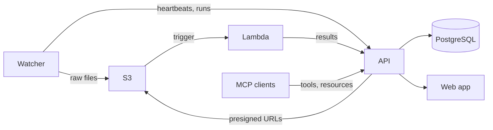

# Architecture

Data Hub is a platform for automatically ingesting, processing, and visualizing data from laboratory instruments. It is structured as a monorepo with four components that work together through S3, a REST API, and a shared Python library.

## System overview

## Components

| Directory | Package | Description |
| --- | --- | --- |
| `web-app/` | `data-hub-web-app` | Next.js web application, REST API, and MCP server. Deployed on Vercel. |
| `lambda/` | `data-hub-lambda` | AWS Lambda function triggered by S3 uploads. Runs instrument-specific processing pipelines. |
| `watcher/` | `data-hub-watcher` | CLI agent installed on lab instrument PCs. Detects new files, uploads them to S3, and reports status to the API. |
| `packages/shared/` | `data-hub-shared` | Shared Python library providing S3 utilities, instrument enums, Slack integration, and test infrastructure. |

## Data flow

### Automatic upload (auto mode)

1. A lab instrument writes output files to a watched directory.
2. The **watcher** detects new stable files using filesystem events (`watchdog`).
3. It groups files into runs (by filename prefix or subdirectory) and reports each run to the **API**.
4. It uploads raw files to **S3** at the key `{instrument_id}/{run_id}/{filename}`.
5. The S3 upload triggers the **Lambda** function.
6. Lambda downloads the file and dispatches to the appropriate instrument processor for preprocessing (e.g., extracting metadata).
7. Lambda creates/updates the run and files via the **API** and sends a **Slack** notification.
8. Users view the run in the **web dashboard**.

### Manual upload (manual mode)

Steps 1–3 are the same, but the watcher does not upload immediately. Instead:

4. The server adds files to an upload queue.
5. On each heartbeat tick, the watcher polls the upload queue and uploads requested files.
6. Steps 5–8 from automatic mode follow.

## Key design decisions

- **S3 as the integration boundary.** The watcher and Lambda never communicate directly. S3 acts as a durable hand-off point: the watcher writes, Lambda reads.
- **API-driven coordination.** The watcher registers with the API, syncs its YAML config, and sends periodic heartbeats. This lets the web dashboard show watcher health and manage upload queues.
- **Presigned URLs from the API.** The web app generates presigned S3 upload and download URLs so watchers and browsers can transfer files directly to/from S3 without routing data through the API. On Vercel, the app assumes an IAM role via OIDC federation (no long-lived AWS credentials).
- **Shared library for contracts.** Instrument IDs, S3 utilities, and environment config live in `data-hub-shared` so they stay consistent across Lambda and the watcher without duplicating code.
- **MCP for AI access.** The web app includes a [Model Context Protocol](https://modelcontextprotocol.io/) server at `/api/v1/mcp` that exposes read-only tools, resources, and prompts. AI clients (e.g. Claude Desktop, Cursor) can query instruments, runs, and system status using a personal access token.
- **Integration tests against a real server.** The shared `testing.py` module spins up a real Next.js server backed by a Postgres database, so Lambda and watcher integration tests exercise the actual API surface.
