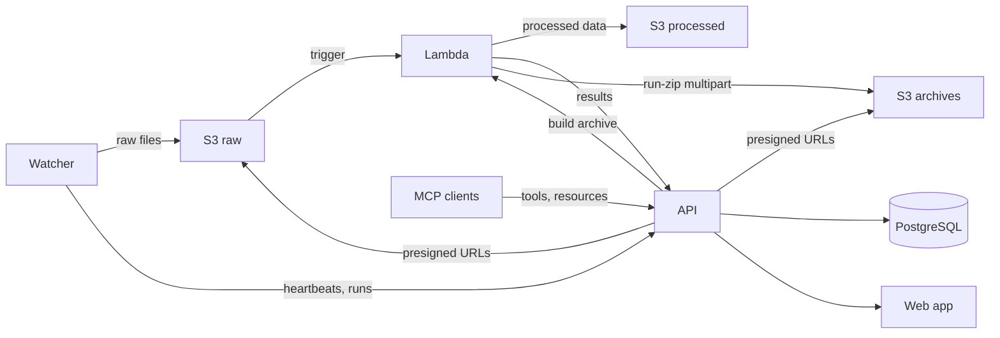

<Audience>Engineers and operators</Audience>

Data Hub has four components that coordinate through S3, a REST API, and a shared
Python library. This page is the conceptual map; the deployment mechanics live in
the [first-time deployment guide](https://github.com/Arcadia-Science/data-hub/blob/production/docs/developer/first-time-deployment.md)
in the data-hub developer docs.

## System overview

## Components

| Component | Package | Description |
| --- | --- | --- |
| Web app | `data-hub-web` | Next.js web application, REST API, and MCP server. Deployed on Vercel. |
| Lambda | `data-hub-lambda` | AWS Lambda function triggered by S3 uploads. Runs instrument-specific processing. |
| Watcher | `data-hub-watcher` | CLI on lab instrument PCs. Detects new files, uploads them to S3, reports status to the API. |
| Shared library | `data-hub-shared` | Shared Python library: S3 utilities, instrument enums, test infrastructure. |

## Data flow

### Automatic upload (auto mode)

1. A lab instrument writes output files to a watched directory.
2. The **watcher** detects new stable files via filesystem events.
3. It groups files into runs and reports each run to the **API**.
4. It uploads raw files to **S3** at the key `{instrument_id}/{run_id}/{filename}`.
5. The S3 upload triggers the **Lambda**.
6. Lambda dispatches to the instrument’s processor, which reads the file for preprocessing. Very large files can be read from a read-only mount of the raw bucket instead of being downloaded, when the deployment turns that option on.
7. Lambda creates/updates the run and files via the **API**, which sends a **Slack** notification once per new run.
8. Users view the run in the **web dashboard**.

### Manual upload (manual mode)

Steps 1–3 are the same, but the watcher doesn’t upload immediately:

4. The server adds files to an upload queue.
5. Once a minute the watcher checks the queue and uploads the files someone requested.
6. Steps 5–8 from auto mode follow.

From watcher 1.2.1, auto-mode watchers check the same queue, so **Upload** on a run page works for them too.

## Key design decisions

- **S3 is the integration boundary.** The watcher and Lambda never talk directly; S3 is the durable hand-off: the watcher writes, Lambda reads.
- **API-driven coordination.** The watcher registers, syncs its YAML config, and heartbeats, which is what powers dashboard health and the upload queue.
- **Pre-signed URLs from the API.** The web app mints pre-signed S3 upload/download URLs so bytes move directly to/from S3 without routing through the API. On Vercel the app assumes an AWS Identity and Access Management (IAM) role via OpenID Connect (OIDC), with no long-lived AWS keys.
- **Lambda-built run archives.** “Download all” delegates to the Lambda, which zips files into a separate archives bucket via S3 multipart upload; the web app then 302s the browser to a short-lived presigned URL. Bytes never traverse Vercel.
- **Shared library for contracts.** Instrument IDs, S3 utilities, and environment config live in `data-hub-shared` so Lambda and the watcher stay consistent.
- **MCP for AI access.** The web app serves an MCP endpoint at `/mcp/v1` exposing tools, resources, and prompts to AI clients. Clients authenticate with OAuth against the same Better Auth instance that signs people in to the dashboard, so an agent acts as the person who approved it. See [MCP overview](/docs/mcp).

## Branch and environment strategy

| Branch | Purpose |
| --- | --- |
| `staging` | Pre-production. Pull requests merge here first. |
| `production` | Live. Changes are promoted from `staging`. |

Feature branches target `staging` via pull requests (PRs). Continuous integration
(CI) runs on every PR and on merges to both branches; merges to `staging` and
`production` deploy each component to its environment automatically. Staging and
production are independent deployments with separate databases.
